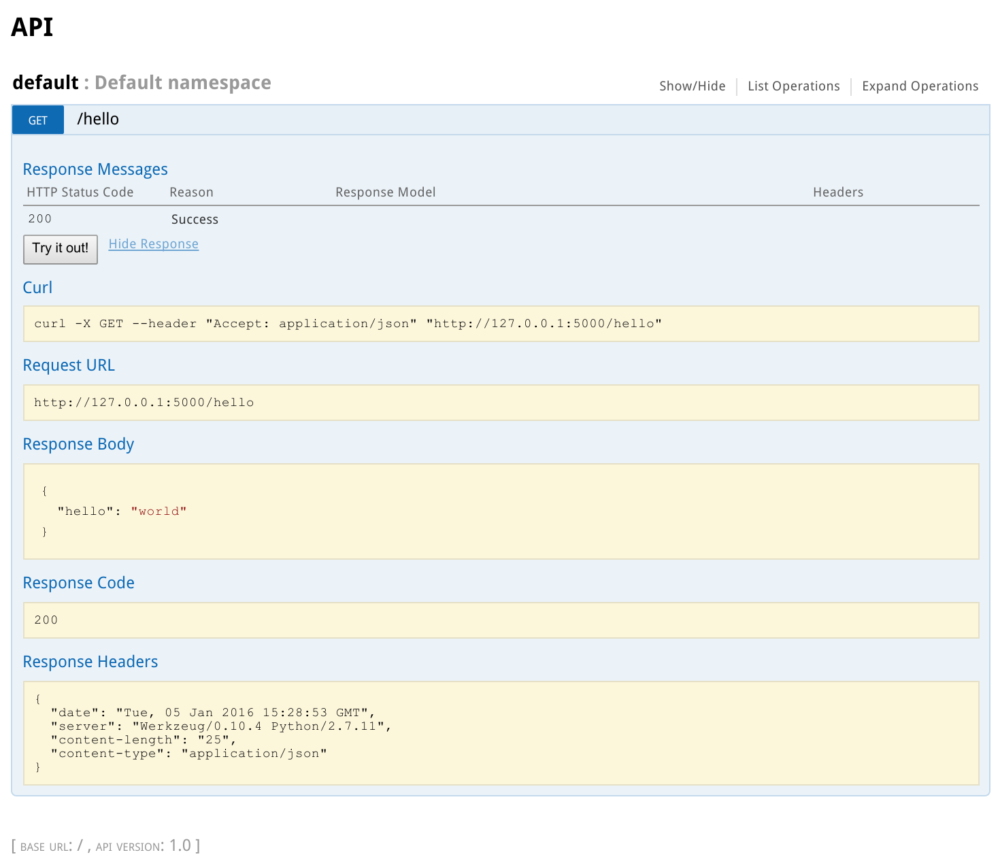

.. _swagger:

Swagger documentation
=====================

.. currentmodule:: flask_restplus

Swagger API documentation is automatically generated and available from your API's root URL.  You can configure the documentation using the :meth:`@api.doc() <Api.doc>` decorator.

Documenting with the ``@api.doc()`` decorator
---------------------------------------------

The ``api.doc()`` decorator allows you to include additional information in the documentation.

You can document a class or a method:

.. code-block:: python

    @api.route('/my-resource/<id>', endpoint='my-resource')
    @api.doc(params={'id': 'An ID'})
    class MyResource(Resource):
        def get(self, id):
            return {}

        @api.doc(responses={403: 'Not Authorized'})
        def post(self, id):
            api.abort(403)

Automatically documented models
-------------------------------

All models instantiated with :meth:`~Namespace.model`, :meth:`~Namespace.clone` and :meth:`~Namespace.inherit`
will be automatically documented in your Swagger specifications.

The :meth:`~Namespace.inherit` method will register both the parent and the child in the Swagger models definitions:

.. code-block:: python

    parent = api.model('Parent', {
        'name': fields.String,
        'class': fields.String(discriminator=True)
    })

    child = api.inherit('Child', parent, {
        'extra': fields.String
    })

The above configuration will produce these Swagger definitions:

.. code-block:: json

    "Parent": {
        "properties": {
            "name": {"type": "string"},
            "class": {"type": "string"}
        },
        "discriminator": "class",
        "required": ["class"]
    },
    "Child": {
        "allOf": [{
                "$ref": "#/definitions/Parent"
            }, {
                "properties": {
                    "extra": {"type": "string"}
                }
            }
        ]
    }

The ``@api.marshal_with()`` decorator
-------------------------------------

This decorator works like the raw :func:`marshal_with` decorator
with the difference that it documents the methods.
The optional parameter ``code`` allows you to specify the expected HTTP status code (200 by default).
The optional parameter ``as_list`` allows you to specify whether or not the objects are returned as a list.

.. code-block:: python

    resource_fields = api.model('Resource', {
        'name': fields.String,
    })

    @api.route('/my-resource/<id>', endpoint='my-resource')
    class MyResource(Resource):
        @api.marshal_with(resource_fields, as_list=True)
        def get(self):
            return get_objects()

        @api.marshal_with(resource_fields, code=201)
        def post(self):
            return create_object(), 201

The :meth:`Api.marshal_list_with` decorator is strictly equivalent to :meth:`Api.marshal_with(fields, as_list=True)`.

.. code-block:: python

    resource_fields = api.model('Resource', {
        'name': fields.String,
    })

    @api.route('/my-resource/<id>', endpoint='my-resource')
    class MyResource(Resource):
        @api.marshal_list_with(resource_fields)
        def get(self):
            return get_objects()

        @api.marshal_with(resource_fields)
        def post(self):
            return create_object()

The ``@api.expect()`` decorator
-------------------------------

The ``@api.expect()`` decorator allows you to specify the expected input fields.
It accepts an optional boolean parameter ``validate`` indicating whether the payload should be validated.
The validation behavior can be customized globally either
by setting the ``RESTPLUS_VALIDATE`` configuration to ``True``
or passing ``validate=True`` to the API constructor.

The following examples are equivalent:

* Using the ``@api.expect()`` decorator:

.. code-block:: python

    resource_fields = api.model('Resource', {
        'name': fields.String,
    })

    @api.route('/my-resource/<id>')
    class MyResource(Resource):
        @api.expect(resource_fields)
        def get(self):
            pass

* Using the ``api.doc()`` decorator:

.. code-block:: python

    resource_fields = api.model('Resource', {
        'name': fields.String,
    })

    @api.route('/my-resource/<id>')
    class MyResource(Resource):
        @api.doc(body=resource_fields)
        def get(self):
            pass

You can specify lists as the expected input:

.. code-block:: python

    resource_fields = api.model('Resource', {
        'name': fields.String,
    })

    @api.route('/my-resource/<id>')
    class MyResource(Resource):
        @api.expect([resource_fields])
        def get(self):
            pass

You can use :exc:`~flask_restplus.reqparse.RequestParser` to define the expected input:

.. code-block:: python

    parser = api.parser()
    parser.add_argument('param', type=int, help='Some param', location='form')
    parser.add_argument('in_files', type=FileStorage, location='files')

    @api.route('/with-parser/', endpoint='with-parser')
    class WithParserResource(restplus.Resource):
        @api.expect(parser)
        def get(self):
            return {}

Validation can be enabled or disabled on a particular endpoint:

.. code-block:: python

    resource_fields = api.model('Resource', {
        'name': fields.String,
    })

    @api.route('/my-resource/<id>')
    class MyResource(Resource):
        # Payload validation disabled
        @api.expect(resource_fields)
        def post(self):
            pass

        # Payload validation enabled
        @api.expect(resource_fields, validate=True)
        def post(self):
            pass

An example of application-wide validation by config:

.. code-block:: python

    app.config['RESTPLUS_VALIDATE'] = True

    api = Api(app)

    resource_fields = api.model('Resource', {
        'name': fields.String,
    })

    @api.route('/my-resource/<id>')
    class MyResource(Resource):
        # Payload validation enabled
        @api.expect(resource_fields)
        def post(self):
            pass

        # Payload validation disabled
        @api.expect(resource_fields, validate=False)
        def post(self):
            pass

An example of application-wide validation by constructor:

.. code-block:: python

    api = Api(app, validate=True)

    resource_fields = api.model('Resource', {
        'name': fields.String,
    })

    @api.route('/my-resource/<id>')
    class MyResource(Resource):
        # Payload validation enabled
        @api.expect(resource_fields)
        def post(self):
            pass

        # Payload validation disabled
        @api.expect(resource_fields, validate=False)
        def post(self):
            pass

Documenting with the ``@api.response()`` decorator
--------------------------------------------------

The ``@api.response()`` decorator allows you to document the known responses
and is a shortcut for ``@api.doc(responses='...')``.

The following two definitions are equivalent:

.. code-block:: python

    @api.route('/my-resource/')
    class MyResource(Resource):
        @api.response(200, 'Success')
        @api.response(400, 'Validation Error')
        def get(self):
            pass

    @api.route('/my-resource/')
    class MyResource(Resource):
        @api.doc(responses={
            200: 'Success',
            400: 'Validation Error'
        })
        def get(self):
            pass

You can optionally specify a response model as the third argument:

.. code-block:: python

    model = api.model('Model', {
        'name': fields.String,
    })

    @api.route('/my-resource/')
    class MyResource(Resource):
        @api.response(200, 'Success', model)
        def get(self):
            pass

The ``@api.marshal_with()`` decorator automatically documents the response:

.. code-block:: python

    model = api.model('Model', {
        'name': fields.String,
    })

    @api.route('/my-resource/')
    class MyResource(Resource):
        @api.response(400, 'Validation error')
        @api.marshal_with(model, code=201, description='Object created')
        def post(self):
            pass

You can specify a default response sent without knowing the response code:

.. code-block:: python

    @api.route('/my-resource/')
    class MyResource(Resource):
        @api.response('default', 'Error')
        def get(self):
            pass

The ``@api.route()`` decorator
------------------------------

You can provide class-wide documentation using the ``doc`` parameter of ``Api.route()``. This parameter accepts the same values as the ``Api.doc()`` decorator.

For example, these two declarations are equivalent:

* Using ``@api.doc()``:

.. code-block:: python

    @api.route('/my-resource/<id>', endpoint='my-resource')
    @api.doc(params={'id': 'An ID'})
    class MyResource(Resource):
        def get(self, id):
            return {}

* Using ``@api.route()``:

.. code-block:: python

    @api.route('/my-resource/<id>', endpoint='my-resource', doc={params:{'id': 'An ID'}})
    class MyResource(Resource):
        def get(self, id):
            return {}

Documenting the fields
----------------------

Every Flask-Restplus field accepts optional arguments used to document the field:

- ``required``: a boolean indicating if the field is always set (*default*: ``False``)
- ``description``: some details about the field (*default*: ``None``)
- ``example``: an example to use when displaying (*default*: ``None``)

There are also field-specific attributes:

* The ``String`` field accepts the following optional arguments:
    - ``enum``: an array restricting the authorized values.
    - ``min_length``: the minimum length expected.
    - ``max_length``: the maximum length expected.
    - ``pattern``: a RegExp pattern used to validate the string.

* The ``Integer``, ``Float`` and ``Arbitrary`` fields accept the following optional arguments:
    - ``min``: restrict the minimum accepted value.
    - ``max``: restrict the maximum accepted value.
    - ``exclusiveMin``: if ``True``, minimum value is not in allowed interval.
    - ``exclusiveMax``: if ``True``, maximum value is not in allowed interval.
    - ``multiple``: specify that the number must be a multiple of this value.

* The ``DateTime`` field accepts the ``min``, ``max``, ``exclusiveMin`` and ``exclusiveMax`` optional arguments.  These should be dates or datetimes (either ISO strings or native objects).

.. code-block:: python

    my_fields = api.model('MyModel', {
        'name': fields.String(description='The name', required=True),
        'type': fields.String(description='The object type', enum=['A', 'B']),
        'age': fields.Integer(min=0),
    })

Documenting the methods
-----------------------

Each resource will be documented as a Swagger path.

Each resource method (``get``, ``post``, ``put``, ``delete``, ``path``, ``options``, ``head``)
will be documented as a Swagger operation.

You can specify a unique Swagger ``operationId`` with the ``id`` keyword argument:

.. code-block:: python

    @api.route('/my-resource/')
    class MyResource(Resource):
        @api.doc(id='get_something')
        def get(self):
            return {}

You can also use the first argument for the same purpose:

.. code-block:: python

    @api.route('/my-resource/')
    class MyResource(Resource):
        @api.doc('get_something')
        def get(self):
            return {}

If not specified, a default ``operationId`` is provided with the following pattern::

    {{verb}}_{{resource class name | camelCase2dashes }}

In the previous example, the default generated ``operationId`` would be ``get_my_resource``.

You can override the default ``operationId`` generator by providing a callable for the ``default_id`` parameter.
This callable accepts two positional arguments:

* The resource class name
* The HTTP method (lower-case)

.. code-block:: python

    def default_id(resource, method):
        return ''.join((method, resource))

    api = Api(app, default_id=default_id)

In the previous example, the generated ``operationId`` would be ``getMyResource``.

Each operation will automatically receive the namespace tag.
If the resource is attached to the root API, it will receive the default namespace tag.

Method parameters
~~~~~~~~~~~~~~~~~

Parameters from the URL path are documented automatically.
You can provide additional information using the ``params`` keyword argument of the ``api.doc()`` decorator:

.. code-block:: python

    @api.route('/my-resource/<id>', endpoint='my-resource')
    @api.doc(params={'id': 'An ID'})
    class MyResource(Resource):
        pass

or by using the ``api.param`` shortcut decorator:

.. code-block:: python

    @api.route('/my-resource/<id>', endpoint='my-resource')
    @api.param('id', 'An ID')
    class MyResource(Resource):
        pass

Input and output models
~~~~~~~~~~~~~~~~~~~~~~~

You can specify the serialized output model using the ``model`` keyword argument of the ``api.doc()`` decorator.

For ``POST`` and ``PUT`` methods, use the ``body`` keyword argument to specify the input model.

.. code-block:: python

    fields = api.model('MyModel', {
        'name': fields.String(description='The name', required=True),
        'type': fields.String(description='The object type', enum=['A', 'B']),
        'age': fields.Integer(min=0),
    })

    @api.model(fields={'name': fields.String, 'age': fields.Integer})
    class Person(fields.Raw):
        def format(self, value):
            return {'name': value.name, 'age': value.age}

    @api.route('/my-resource/<id>', endpoint='my-resource')
    @api.doc(params={'id': 'An ID'})
    class MyResource(Resource):
        @api.doc(model=fields)
        def get(self, id):
            return {}

        @api.doc(model='MyModel', body=Person)
        def post(self, id):
            return {}

If both ``body`` and ``formData`` parameters are used, a :exc:`~flask_restplus.errors.SpecsError` will be raised.

Models can also be specified with a :class:`~flask_restplus.reqparse.RequestParser`.

.. code-block:: python

    parser = api.parser()
    parser.add_argument('param', type=int, help='Some param', location='form')
    parser.add_argument('in_files', type=FileStorage, location='files')

    @api.route('/with-parser/', endpoint='with-parser')
    class WithParserResource(restplus.Resource):
        @api.expect(parser)
        def get(self):
            return {}

.. note:: The decoded payload will be available as a dictionary in the payload attribute
          in the request context.

          .. code-block:: python

            @api.route('/my-resource/')
            class MyResource(Resource):
                def get(self):
                    data = api.payload

.. note::

    Using :class:`~flask_restplus.reqparse.RequestParser` is prefered over the ``api.param()`` decorator
    to document form fields as it also perform validation.

Headers
~~~~~~~

You can document response headers with the ``@api.header()`` decorator shortcut.

.. code-block:: python

    @api.route('/with-headers/')
    @api.header('X-Header', 'Some class header')
    class WithHeaderResource(restplus.Resource):
        @api.header('X-Collection', type=[str], collectionType='csv')
        def get(self):
            pass

If you need to specify an header that appear only on a gvien response,
just use the `@api.response` `headers` parameter.

.. code-block:: python

    @api.route('/response-headers/')
    class WithHeaderResource(restplus.Resource):
        @api.response(200, 'Success', headers={'X-Header': 'Some header'})
        def get(self):
            pass

Documenting expected/request headers is done through the `@api.expect` decorator

.. code-block:: python

    parser = api.parser()
    parser.add_argument('Some-Header', location='headers')

    @api.route('/expect-headers/')
    @api.expect(parser)
    class ExpectHeaderResource(restplus.Resource):
        def get(self):
            pass

Cascading
---------

Method documentation takes precedence over class documentation,
and inherited documentation takes precedence over parent documentation.

For example, these two declarations are equivalent:

* Class documentation is inherited by methods:

.. code-block:: python

    @api.route('/my-resource/<id>', endpoint='my-resource')
    @api.params('id', 'An ID')
    class MyResource(Resource):
        def get(self, id):
            return {}

* Class documentation is overridden by method-specific documentation:

.. code-block:: python

    @api.route('/my-resource/<id>', endpoint='my-resource')
    @api.param('id', 'Class-wide description')
    class MyResource(Resource):
        @api.param('id', 'An ID')
        def get(self, id):
            return {}

You can also provide method-specific documentation from a class decorator.
The following example will produce the same documentation as the two previous examples:

.. code-block:: python

    @api.route('/my-resource/<id>', endpoint='my-resource')
    @api.params('id', 'Class-wide description')
    @api.doc(get={'params': {'id': 'An ID'}})
    class MyResource(Resource):
        def get(self, id):
            return {}

Marking as deprecated
---------------------

You can mark resources or methods as deprecated with the ``@api.deprecated`` decorator:

.. code-block:: python

    # Deprecate the full resource
    @api.deprecated
    @api.route('/resource1/')
    class Resource1(Resource):
        def get(self):
            return {}

    # Hide methods
    @api.route('/resource4/')
    class Resource4(Resource):
        def get(self):
            return {}

        @api.deprecated
        def post(self):
            return {}

        def put(self):
            return {}

Hiding from documentation
-------------------------

You can hide some resources or methods from documentation using any of the following:

.. code-block:: python

    # Hide the full resource
    @api.route('/resource1/', doc=False)
    class Resource1(Resource):
        def get(self):
            return {}

    @api.route('/resource2/')
    @api.doc(False)
    class Resource2(Resource):
        def get(self):
            return {}

    @api.route('/resource3/')
    @api.hide
    class Resource3(Resource):
        def get(self):
            return {}

    # Hide methods
    @api.route('/resource4/')
    @api.doc(delete=False)
    class Resource4(Resource):
        def get(self):
            return {}

        @api.doc(False)
        def post(self):
            return {}

        @api.hide
        def put(self):
            return {}

        def delete(self):
            return {}

Documenting authorizations
--------------------------

You can use the ``authorizations`` keyword argument to document authorization information:

.. code-block:: python

    authorizations = {
        'apikey': {
            'type': 'apiKey',
            'in': 'header',
            'name': 'X-API-KEY'
        }
    }
    api = Api(app, authorizations=authorizations)

Then decorate each resource and method that requires authorization:

.. code-block:: python

    @api.route('/resource/')
    class Resource1(Resource):
        @api.doc(security='apikey')
        def get(self):
            pass

        @api.doc(security='apikey')
        def post(self):
            pass

You can apply this requirement globally with the ``security`` parameter on the ``Api`` constructor:

.. code-block:: python

    authorizations = {
        'apikey': {
            'type': 'apiKey',
            'in': 'header',
            'name': 'X-API-KEY'
        }
    }
    api = Api(app, authorizations=authorizations, security='apikey')

You can have multiple security schemes:

.. code-block:: python

    authorizations = {
        'apikey': {
            'type': 'apiKey',
            'in': 'header',
            'name': 'X-API'
        },
        'oauth2': {
            'type': 'oauth2',
            'flow': 'accessCode',
            'tokenUrl': 'https://somewhere.com/token',
            'scopes': {
                'read': 'Grant read-only access',
                'write': 'Grant read-write access',
            }
        }
    }
    api = Api(self.app, security=['apikey', {'oauth2': 'read'}], authorizations=authorizations)

Security schemes can be overridden for a particular method:

.. code-block:: python

    @api.route('/authorizations/')
    class Authorized(Resource):
        @api.doc(security=[{'oauth2': ['read', 'write']}])
        def get(self):
            return {}

You can disable security on a given resource or method by passing ``None`` or an empty list as the ``security`` parameter:

.. code-block:: python

    @api.route('/without-authorization/')
    class WithoutAuthorization(Resource):
        @api.doc(security=[])
        def get(self):
            return {}

        @api.doc(security=None)
        def post(self):
            return {}

Expose vendor Extensions
------------------------

Swaggers allows you to expose custom `vendor extensions`_ and you can use them
in Flask-RESTPlus with the `@api.vendor` decorator.

It supports both extensions as `dict` or `kwargs` and perform automatique `x-` prefix:

.. code-block:: python

    @api.route('/vendor/')
    @api.vendor(extension1='any authorized value')
    class Vendor(Resource):
        @api.vendor({
            'extension-1': {'works': 'with complex values'},
            'x-extension-3': 'x- prefix is optionnal',
        })
        def get(self):
            return {}

Export Swagger specifications
-----------------------------

You can export the Swagger specifications for your API:

.. code-block:: python

    from flask import json

    from myapp import api

    print(json.dumps(api.__schema__))

.. _swaggerui:

Swagger UI
----------

By default ``flask-restplus`` provides Swagger UI documentation, served from the root URL of the API.

.. code-block:: python

    from flask import Flask
    from flask_restplus import Api, Resource, fields

    app = Flask(__name__)
    api = Api(app, version='1.0', title='Sample API',
        description='A sample API',
    )

    @api.route('/my-resource/<id>')
    @api.doc(params={'id': 'An ID'})
    class MyResource(Resource):
        def get(self, id):
            return {}

        @api.response(403, 'Not Authorized')
        def post(self, id):
            api.abort(403)

    if __name__ == '__main__':
        app.run(debug=True)

If you run the code below and visit your API's root URL (http://localhost:5000)
you can view the automatically-generated Swagger UI documentation.

Customization
~~~~~~~~~~~~~

You can control the Swagger UI path with the ``doc`` parameter (defaults to the API root):

.. code-block:: python

    from flask import Flask, Blueprint
    from flask_restplus import Api

    app = Flask(__name__)
    blueprint = Blueprint('api', __name__, url_prefix='/api')
    api = Api(blueprint, doc='/doc/')

    app.register_blueprint(blueprint)

    assert url_for('api.doc') == '/api/doc/'

You can specify a custom validator URL by setting ``config.SWAGGER_VALIDATOR_URL``:

.. code-block:: python

    from flask import Flask
    from flask_restplus import Api

    app = Flask(__name__)
    app.config.SWAGGER_VALIDATOR_URL = 'http://domain.com/validator'

    api = Api(app)

You can also specify the initial expansion state with the ``config.SWAGGER_UI_DOC_EXPANSION``
setting (``'none'``, ``'list'`` or ``'full'``):

.. code-block:: python

    from flask import Flask
    from flask_restplus import Api

    app = Flask(__name__)
    app.config.SWAGGER_UI_DOC_EXPANSION = 'list'

    api = Api(app)

You can enable a JSON editor in Swagger UI by setting ``config.SWAGGER_UI_JSONEDITOR`` to ``True``:

.. code-block:: python

    from flask import Flask
    from flask_restplus import Api

    app = Flask(__name__)
    app.config.SWAGGER_UI_JSONEDITOR = True

    api = Api(app)

It also support optionnal translations through ``config.SWAGGER_UI_LANGUAGES``:

.. code-block:: python

    from flask import Flask
    from flask_restplus import Api

    app = Flask(__name__)
    app.config.SWAGGER_UI_LANGUAGES = ['en', 'fr']

    api = Api(app)

See `the official documentation <https://github.com/swagger-api/swagger-ui#user-content-localization-and-translation>`_
for more details.

If you need a custom UI,
you can register a custom view function with the :meth:`~Api.documentation` decorator:

.. code-block:: python

    from flask import Flask
    from flask_restplus import API, apidoc

    app = Flask(__name__)
    api = Api(app)

    @api.documentation
    def custom_ui():
        return apidoc.ui_for(api)

Disabling the documentation
~~~~~~~~~~~~~~~~~~~~~~~~~~~

To disable Swagger UI entirely, set ``doc=False``:

.. code-block:: python

    from flask import Flask
    from flask_restplus import Api

    app = Flask(__name__)
    api = Api(app, doc=False)

.. _vendor extensions: http://swagger.io/specification/#specification-extensions-128
